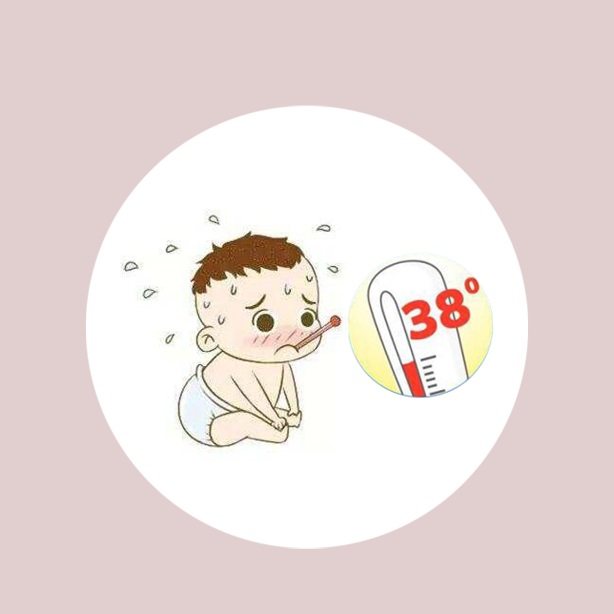

## Welcome to My Baby Sick Record Tool

Have you ever encountered that when our baby was sick, we were very anxious and wanted to help our baby, but did not know what we could do for the baby. If you have had such experience and distress, this app will help you do something. You can keep track of when your baby is sick and what symptoms it is. You can also record detailed information about how many days have passed between the time when your baby was ill and the time when he was last ill, and your body temperature when you were ill. You can collect and organize this information about your baby, and provide it to your baby's doctor for review, so that the doctor can understand the baby's past illness experience in more detail, so that the baby can recover health faster.

If you have any questions, you can either leave a message or send the questions to our email address.

We will answer them for you in the first time.

### Address: BeatriceArlenexSgPdE@yahoo.com

Thank you!
